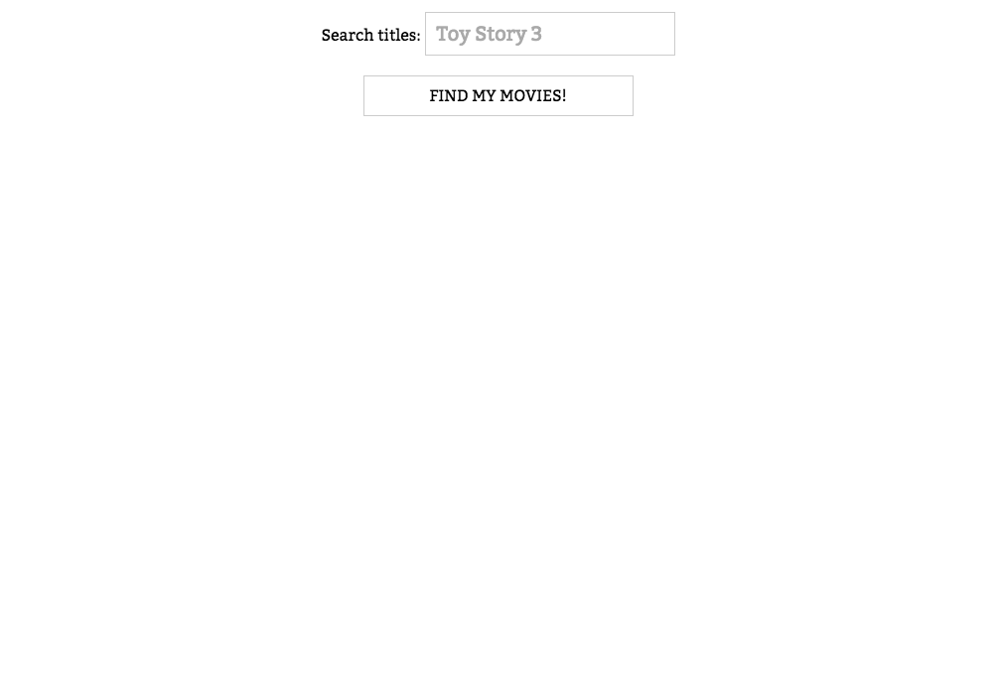
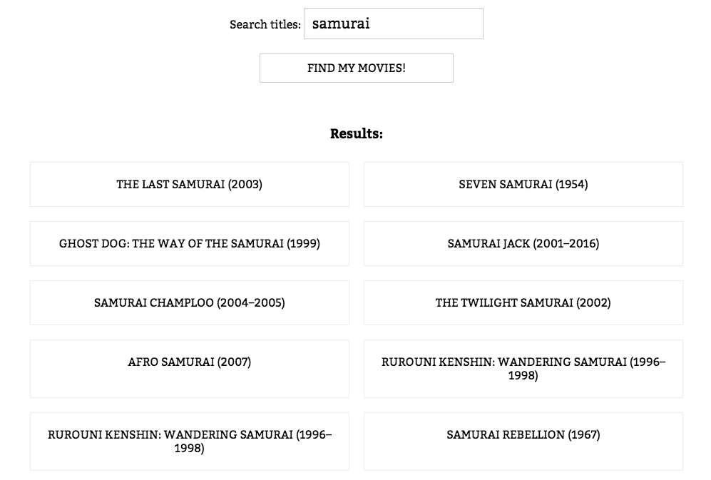
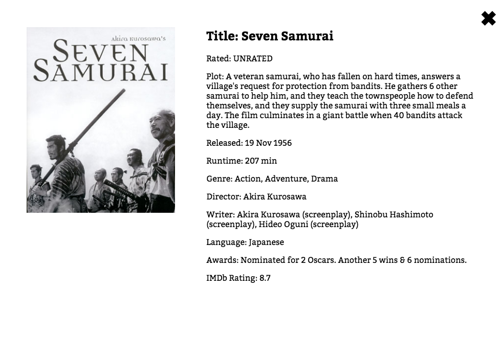

# OMdB search app

In this project, you'll use what you've learned about React to build an app that can perform simple search queries on the movies API provided by [OMdB](http://www.omdbapi.com/).

Your project should live within a GitHub repository so that we can review your code and provide feedback.

## App specs

This app has three primary states:

1.	Landing state with search bar

	

2.	Display search results in response to user interaction

	

3.	Display movie details in response to user selection

	

Per the OMdB documentation, the two endpoints you'll need to hit for data are:

*	`http://www.omdbapi.com/?s=samurai`
This endpoint will return the list of results for titles matching the search term (in the example above, the search term is "samurai").

*	`http://www.omdbapi.com/?i=tt0165798&plot=full&r=json`
This endpoint will return detailed information for the title matching the ID supplied (in the example above, the ID is "tt0165798").

## Starter code

You may reference the `webpack-babel-react` example in this repository to help bootstrap your application.